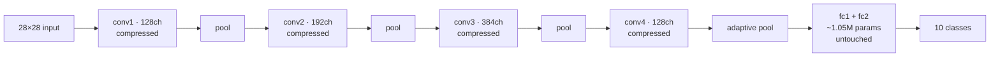

# TensorPress

[](https://pypi.org/project/tensorpress/)
[](#)
[](#)
[](https://www.python.org/)

TensorPress compresses PyTorch convolutional neural networks by replacing
selected `Conv2d` layers with Tucker-2 or CPD tensor factorization modules. It
keeps the user workflow simple: configure compression intent, run the compressor,
inspect the result, optionally fine-tune, and export the compressed model.

## Installation

Install into an isolated environment. Quote the extras so your shell does not
expand the brackets (required in zsh):

```bash
python3 -m venv .venv
source .venv/bin/activate
pip install 'tensorpress[torch]'
```

For rich terminal reports:

```bash
pip install 'tensorpress[torch,rich]'
```

Using [uv](https://docs.astral.sh/uv/):

```bash
uv venv
uv pip install 'tensorpress[torch]'
```

See [Getting Started](docs/getting_started.md) for contributor setup with the
committed lockfile (`uv sync`).

## Minimal Example

```python
from tensorpress import CompressConfig, Compressor

model = MyModel()

cfg = CompressConfig(
    method="tucker",        # "tucker" or "cpd"
    layers="all",           # "all", names, regex, or callable
    compression_ratio=4.0,  # target N-fold size reduction (>= 1); ~4x smaller
    use_bn=False,
    finetune=False,
)

compressor = Compressor(cfg)
result = compressor.compress(model)

result.report()
result.export("compressed.pt")
```

With fine-tuning:

```python
from tensorpress.config import FinetuneConfig

cfg = CompressConfig(
    method="cpd",
    layers=lambda name, module: "features" in name,
    ranks="auto",
    finetune=True,
    finetune_config=FinetuneConfig(epochs=3, lr=1e-4),
)

result = Compressor(cfg).compress(
    model,
    dataloader={"train": train_loader, "val": val_loader},
)
```

## Documentation

The documentation source lives in [`docs/`](docs/). Build it with:

```bash
mkdocs build -f docs/mkdocs.yml
```

Runnable examples are available in [`examples/`](examples/):

```bash
python examples/quickstart.py --list-datasets
python examples/quickstart.py
python examples/quickstart.py --model fashion-lenet --dataset fashion-mnist
python examples/cifar10_resnet18.py --no-pretrained --head-epochs 1 --ft-epochs 1
```

Dataset-backed tests are optional and skipped by default:

```bash
python -m pytest tests/test_datasets.py --run-dataset-tests --dataset-name cifar10
```

## Example Results

Tucker-2 compression of the quickstart **`FashionLeNet`** (~3.6M parameters:
**2.5M** in four conv layers, **1.1M** in the untouched FC head) on
**Fashion-MNIST** (10,000 train / 4,000 test samples, 10 baseline epochs,
5 fine-tune epochs). `--compression-ratio` is the requested N-fold size
reduction for the **conv stack**; the "Compression" column is the realized
ratio on those layers (the dense classifier dilutes the whole-model number).



| `--compression-ratio` | Baseline acc | Compressed acc | Δ accuracy | Conv compression |
| --- | --- | --- | --- | --- |
| `1.5` | 88.9% | 88.8% | −0.1 pp | 1.50× |
| **`2.0`** | **88.8%** | **88.3%** | **−0.4 pp** | **1.99×** |
| **`3.0`** | **89.8%** | **88.5%** | **−1.3 pp** | **2.99×** |
| `4.0` | 89.4% | 87.9% | −1.5 pp | 3.98× |
| `6.0` | 89.4% | 87.7% | −1.8 pp | 5.99× |
| **`8.0`** | **89.4%** | **86.8%** | **−2.6 pp** | **7.98×** |

At `--compression-ratio 8.0` the conv stack shrinks **~8×** while the whole
model drops only **~62%** of parameters because the FC head stays dense — the
report separates both scopes so the numbers stay honest.

Highlights:

- **Near-lossless up to ~3×:** `--compression-ratio 3.0` hits **2.99×** on the
  conv layers with only **−1.3 pp** accuracy loss (baseline **89.8%**).
- **Aggressive compression:** `--compression-ratio 8.0` reaches **7.98×** on
  convs for **−2.6 pp**, with fine-tuning recovering most of the post-factorization drop.

Reproduce the sweet spot with:

```bash
python examples/quickstart.py \
  --model fashion-lenet --dataset fashion-mnist \
  --epochs 10 --ft-epochs 5 \
  --train-size 10000 --test-size 4000 --compression-ratio 3.0
```

> Fine-tuning matters: aggressive ratios drop sharply right after factorization
> and recover most of the gap over a few fine-tune epochs, so always fine-tune
> after compressing. Use `--model tinycnn` for a faster smoke run (~57k params).

## Contributing

TensorPress is being migrated from research scripts into a library. Keep changes
small, typed, documented, and covered by tests. Run the test suite before opening
a pull request:

```bash
python -m pytest
```

## License

TensorPress is distributed under the license in [`LICENSE`](LICENSE).
